# Data Model

Current state of the backtest data model (v9.0).

As of v9.0 the in-memory representation follows a three-level
hierarchy:

```
Backtest → Study → EngineSlot → BacktestRun
```

All per-engine results — runs and roll-up summaries — live inside an
`EngineSlot` that belongs to a `Study`. A `Backtest` can hold multiple
studies (one per strategy variant or universe slice). `risk_free_rate`
has moved out of the top-level `Backtest` and now lives exclusively on
`Universe`.

---

## Entity-relationship diagram

```mermaid
erDiagram
    %% Structural hierarchy
    BACKTEST ||--|{ STUDY : "studies"
    STUDY ||--o| UNIVERSE : "universe"
    STUDY ||--o{ BACKTEST_WINDOW : "backtest_windows"
    STUDY ||--|{ ENGINE_SLOT : "engine_results"
    STUDY ||--o{ MONTE_CARLO_TEST : "monte_carlo_tests"
    ENGINE_SLOT ||--o{ BACKTEST_RUN : "runs"
    ENGINE_SLOT ||--o| BACKTEST_SUMMARY : "summary (pooled)"

    %% Per-run detail
    BACKTEST_RUN ||--o| BACKTEST_METRICS : "backtest_metrics"
    BACKTEST_RUN ||--o{ TRADE : "trades"
    BACKTEST_RUN ||--o{ POSITION : "positions"
    BACKTEST_RUN ||--o{ PORTFOLIO_SNAPSHOT : "portfolio_snapshots"
    PORTFOLIO_SNAPSHOT ||--o{ POSITION_SNAPSHOT : "positions"

    BACKTEST {
        string algorithm_id PK
        string anchor_algorithm_id "lineage pointer for sibling bundles"
        guid backtest_id
        string framework_version
        int bundle_format_version "5 for v9.0 bundles"
        string tag
        json metadata
        json strategy_ids
        json parameters
    }

    STUDY {
        string name PK "unique within parent Backtest"
        string description
        json metadata
    }

    UNIVERSE {
        string key PK "stable identifier; auto-generated when not supplied"
        string trading_symbol
        string market
        string[] symbols
        float initial_capital
        float risk_free_rate "default 0.027 (2.7%)"
        json metadata
    }

    BACKTEST_WINDOW {
        string name
        int fold_index "null for rolling windows"
        int warmup_days "days at train start reserved for warm-up"
        datetime train_start
        datetime train_end
        string train_name
        datetime test_start "null when no OOS period"
        datetime test_end
        string test_name
        int gap_days "derived: test_start - train_end (days)"
    }

    ENGINE_SLOT {
        string engine "vector | event"
        json summaries_by_universe "Dict[universe_key, BacktestSummaryMetrics]"
    }

    MONTE_CARLO_TEST {
        string name
        string engine "vector | event"
        string method
        string metric
        float observed_value
        json null_distribution
        int n_permutations
        float p_value
        string alternative
        int seed
        string window_name
        string universe_key
        datetime created_at
        json metadata
    }

    BACKTEST_SUMMARY {
        float total_net_gain
        float total_net_gain_percentage
        float total_growth
        float total_growth_percentage
        float total_loss
        float total_loss_percentage
        float average_net_gain
        float average_net_gain_percentage
        float average_growth
        float average_growth_percentage
        float average_loss
        float average_loss_percentage
        float average_trade_return
        float average_trade_return_percentage
        float average_trade_loss
        float average_trade_loss_percentage
        float average_trade_gain
        float average_trade_gain_percentage
        float average_trade_duration
        float average_win_duration
        float average_loss_duration
        float cagr
        float sharpe_ratio
        float sortino_ratio
        float calmar_ratio
        float profit_factor
        float annual_volatility
        float max_drawdown
        int max_drawdown_duration
        float var_95
        float cvar_95
        float trades_per_year
        float trades_per_month
        float trades_per_week
        float win_rate
        float current_win_rate
        float win_loss_ratio
        float current_win_loss_ratio
        int max_consecutive_wins
        int max_consecutive_losses
        int number_of_trades
        int number_of_trades_closed
        float cumulative_exposure
        float exposure_ratio
        int number_of_windows
        int number_of_profitable_windows
        int number_of_windows_with_trades
        float return_consistency
        float win_rate_consistency
        float sharpe_consistency
        float consistency_score
        float return_stability
        float win_rate_stability
        float sharpe_stability
        float stability_score
    }

    BACKTEST_RUN {
        datetime backtest_start_date
        datetime backtest_end_date
        string backtest_date_range_name
        string trading_symbol
        float initial_unallocated
        string universe_key "metadata[universe_key] tag; null = single-universe"
        int number_of_days
        datetime created_at
        string[] symbols
        int number_of_trades
        int number_of_trades_closed
        int number_of_trades_open
        int number_of_orders
        int number_of_positions
        json data_sources
        json signals
        json signal_events
        json recorded_values
        json metadata
    }

    BACKTEST_METRICS {
        datetime backtest_start_date
        datetime backtest_end_date
        string backtest_date_range_name
        string trading_symbol
        float initial_unallocated
        float final_value
        float total_growth
        float total_growth_percentage
        float total_net_gain
        float total_net_gain_percentage
        float total_loss
        float total_loss_percentage
        float gross_profit
        float gross_loss
        float cumulative_return
        float cagr
        float sharpe_ratio
        float sortino_ratio
        float calmar_ratio
        float profit_factor
        float annual_volatility
        float var_95
        float cvar_95
        float max_drawdown
        float max_drawdown_absolute
        float max_daily_drawdown
        int max_drawdown_duration
        float twr_max_drawdown
        int twr_max_drawdown_duration
        int number_of_trades
        int number_of_trades_closed
        int number_of_trades_opened
        int number_of_trades_open_at_end
        int number_of_positive_trades
        float percentage_positive_trades
        int number_of_negative_trades
        float percentage_negative_trades
        float win_rate
        float current_win_rate
        float win_loss_ratio
        float current_win_loss_ratio
        int max_consecutive_wins
        int max_consecutive_losses
        float average_trade_duration
        float average_win_duration
        float average_loss_duration
        float average_trade_size
        float average_trade_loss
        float average_trade_loss_percentage
        float average_trade_gain
        float average_trade_gain_percentage
        float average_trade_return
        float average_trade_return_percentage
        float current_average_trade_gain
        float current_average_trade_gain_percentage
        float current_average_trade_loss
        float current_average_trade_loss_percentage
        float current_average_trade_return
        float current_average_trade_return_percentage
        float current_average_trade_duration
        float median_trade_return
        float median_trade_return_percentage
        float trade_per_day
        float trades_per_week
        float trades_per_month
        float trades_per_year
        float exposure_ratio
        float cumulative_exposure
        json best_trade
        json worst_trade
        json best_month
        json worst_month
        json best_year
        json worst_year
        float percentage_winning_months
        float percentage_winning_years
        float average_monthly_return
        float average_monthly_return_losing_months
        float average_monthly_return_winning_months
        int total_number_of_days
        json equity_curve
        json drawdown_series
        json cumulative_return_series
        json rolling_sharpe_ratio
        json monthly_returns
        json yearly_returns
        json twr_equity_curve
        json twr_drawdown_series
        json metadata
    }

    TRADE {
        guid trade_id PK
        json orders "embedded Order[]"
        string target_symbol
        string trading_symbol
        datetime closed_at
        datetime opened_at
        float open_price
        float amount
        float available_amount
        float cost
        float remaining
        float filled_amount
        string status
        float net_gain
        float total_fees
        float last_reported_price
        datetime last_reported_price_datetime
        float high_water_mark
        datetime high_water_mark_datetime
        datetime updated_at
        json stop_losses
        json take_profits
        json metadata
        bool is_short
    }

    POSITION {
        string symbol
        float amount
        float cost
        string portfolio_id
    }

    PORTFOLIO_SNAPSHOT {
        string portfolio_id
        string trading_symbol
        float pending_value
        float unallocated
        float net_size
        float total_net_gain
        float total_revenue
        float total_cost
        float total_value
        float cash_flow
        datetime created_at
        json metadata
    }

    POSITION_SNAPSHOT {
        string symbol
        float amount
        float cost
        string portfolio_snapshot_id
    }
```



---

## Key v9.0 changes from v8 / legacy

| Area | Old | New |
|------|-----|-----|
| `risk_free_rate` | Top-level field on `Backtest` | Field on `Universe` (default `0.027`) |
| Engine routing | `engine_type` string on `Backtest` and `BacktestRun` | Implicit via `EngineSlot.engine` key (`"vector"` / `"event"`) |
| Run container | Directly on `Backtest` (`backtest_runs`) | `Study.engine_results[engine].runs` |
| Summary container | Directly on `Backtest` (`backtest_summary`) | `EngineSlot.summary` (pooled) + `EngineSlot.summaries_by_universe` (per-regime cache) |
| Multi-universe | Flat list on `Backtest` | One `Study` per universe, each with its own `Universe` object; or one study with per-run `universe_key` tags |
| Walk-forward windows | Implied by run date ranges | First-class `BacktestWindow` objects on `Study` (train/test/gap/warmup) |
| Monte Carlo tests | Top-level on `Backtest` | `Study.monte_carlo_tests` |

---

## Default-study rule

When a `Backtest` holds exactly **one** study, calling
`backtest.get_runs(engine)` / `backtest.get_summary(engine)` without
a `study=` argument transparently delegates to that single study (the
legacy single-bundle path). When two or more studies are present, an
explicit `study=` name is required or an `OperationalException` is
raised. This rule is documented in
`docs/design/multi-study-bundle.md` §4.3.

---

## EngineSlot — `summaries_by_universe`

`EngineSlot.summaries_by_universe` is a cached `Dict[str,
BacktestSummaryMetrics]` keyed by `Universe.key`. It is populated by
`Backtest.regenerate_summaries_by_universe()` after runs are tagged
via `Backtest.tag_runs_universe()`. The pooled `EngineSlot.summary`
covers all runs regardless of universe; the per-key entries let
callers compare performance across baskets without re-aggregating.
